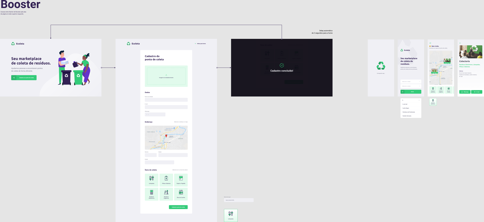

<h1 align="center">
    
    <br />
  🚀 Next Level Week - Booster ♻️
</h1>

<h2 align="center">

  
</h2>
<p align="center">
  <a href="#rocket-tecnologias">Tecnologias</a>&nbsp;&nbsp;&nbsp;|&nbsp;&nbsp;&nbsp;
  <a href="#-projeto">Projeto</a>&nbsp;&nbsp;&nbsp;|&nbsp;&nbsp;&nbsp;
  <a href="#-layout">Layout</a>&nbsp;&nbsp;&nbsp;|&nbsp;&nbsp;&nbsp;
  <a href="#-como-contribuir">Como contribuir</a>&nbsp;&nbsp;&nbsp;|&nbsp;&nbsp;&nbsp;
  <a href="#memo-licença">Licença</a>
</p>
<br />

## :rocket: Tecnologias

Esse projeto foi desenvolvido com as seguintes tecnologias:

- [TypeScript](https://www.typescriptlang.org/)
- [Node.js](https://nodejs.org/en/)
- [ReactJS](https://reactjs.org)
- [React Native](https://facebook.github.io/react-native/)
- [Expo](https://expo.io/)
- [Yup](https://github.com/jquense/yup)

## 💻 Projeto

O <strong>Ecoleta</strong> é uma aplicação Web e Mobile para ajudar pessoas a encontrarem pontos de coleta para reciclagem. ♻️

## :recycle: Layout



## :fire: Como usar

- ### **Pré-requisitos**

  - É **necessário** possuir o **[Node.js](https://nodejs.org/en/)** instalado na máquina
  - Também, é **preciso** ter um gerenciador de pacotes seja o **[NPM](https://www.npmjs.com/)** ou **[Yarn](https://yarnpkg.com/)**.
  - Por fim, é **essencial** ter o **[Expo](https://expo.io/)** instalado de forma global na máquina

1. Faça um clone :

```sh
  $ git clone https://github.com/J-Keven/Ecoleta.git
```

2. Executando a Aplicação:

```sh
  # Instale as dependências
  $ npm i

  ## Crie o banco de dados
  $ cd backend
  $ npm run create:database

  # Inicie a API
  $ npm run dev

  # Inicie a aplicação web
  $ cd web
  $ npm start

  # Inicie a aplicação mobile
  $ cd mobile
  $ npm start
```

## :recycle: Como contribuir

- Faça um fork desse repositório;
- Cria uma branch com a sua feature: `git checkout -b minha-feature`;
- Faça commit das suas alterações: `git commit -m 'feat: Minha nova feature'`;
- Faça push para a sua branch: `git push origin minha-feature`.

Depois que o merge da sua pull request for feito, você pode deletar a sua branch.

## :memo: Licença

Esse projeto está sob a licença MIT. Veja o arquivo [LICENSE](https://github.com/J-Keven/Ecoleta/blob/master/LICENSE) para mais detalhes.

---

<h4 align="center">
    Feito com 💜 by <a href="https://www.linkedin.com/in/keven-nunes-884a97159/" target="_blank">Jhonnas Keven</a>
</h4>
